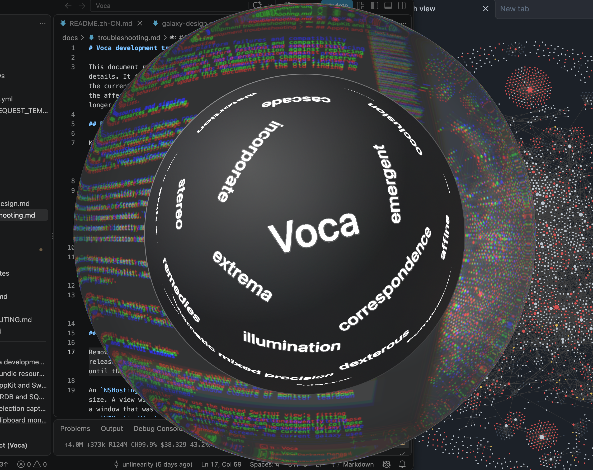
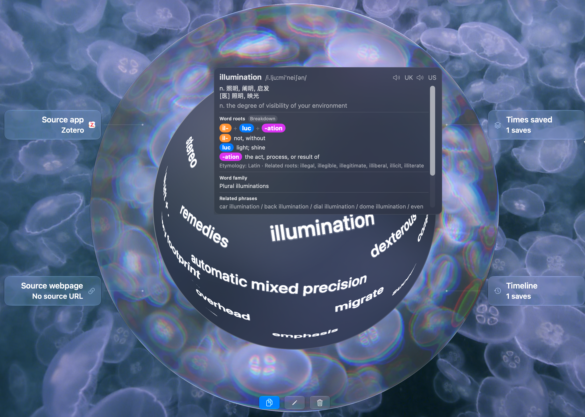
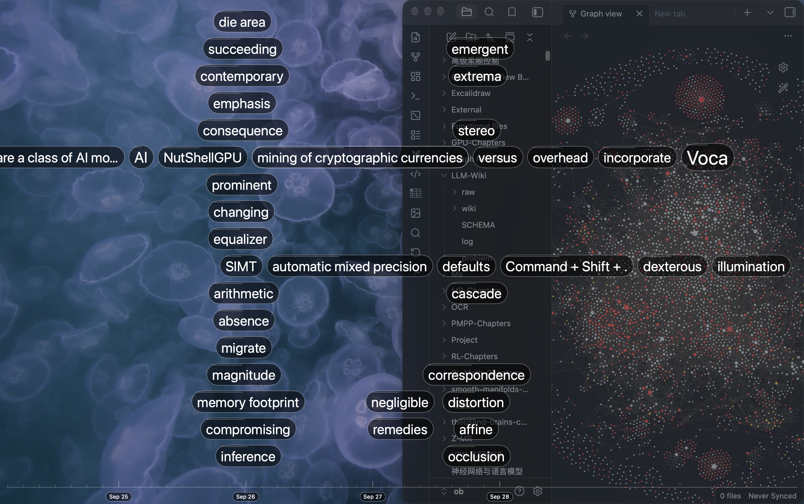
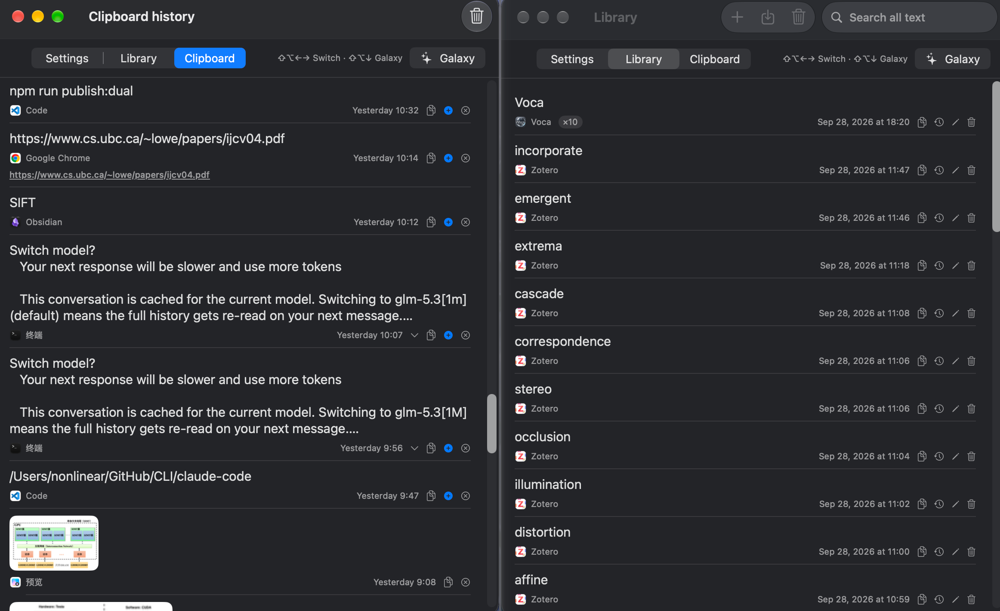

# Voca — macOS 本地文字收藏与查阅

[英文](README.md) · 简体中文

<p align='center'></p>

Voca 是一款开源的菜单栏应用，帮你在本机收藏和回看文字。在其他应用中选中文字即可静默收入词库；还可以使用内嵌词典查词、借助 macOS 翻译，并在全屏时间线或词语星图中浏览收藏。独立的剪贴板历史保留复制的文字与图片。所有收藏存放在本机 SQLite 数据库中。

<p align='center'></p>

## 下载与安装

Voca 需要 macOS 26 或更高版本。请在 [GitHub 发行页面](https://github.com/UNLINEARITY/Voca/releases)查看是否有可下载的应用。如提供 DMG，打开后将 Voca 拖入「应用程序」；如提供 ZIP，解压后将 `Voca.app` 移入「应用程序」。请从「应用程序」启动安装后的应用，不要从已挂载的 DMG 中启动。

若 macOS 阻止打开未经公证的下载版本，可先尝试启动 Voca，再前往**系统设置 → 隐私与安全性 → 仍要打开**。请为安装后的应用授予权限。Voca 目前不会自动更新。只有可选的三指手势需要 Apple 触控板。

## 首次使用

1. 打开 Voca，在 Safari、备忘录等应用里选中文字。
2. 按 **⌥⇧S** 保存。如果 macOS 要求辅助功能权限，请前往**系统设置 → 隐私与安全性 → 辅助功能**，添加实际启动的 `Voca.app`（位于「应用程序」或 `build/`），并打开开关。授权必须由你手动完成。
3. 再选中文字按快捷键。Voca 会静默保存，只在右下角显示简短确认提示，不在提示中展示选中的文字。

界面默认跟随 macOS 的语言偏好：支持简体中文，其余语言回退到英文。若想单独调整，可在**设置 → 通用 → 语言**中选英文或简体中文；选「跟随系统」即可恢复自动选择。系统权限提示与 macOS 右键服务菜单仍跟随系统语言。

## 日常使用

<p align='center'></p>

<p align='center'></p>

| 功能 | 操作与行为 |
|---|---|
| 保存选中文字 | 在任意应用中选中并按 **⌥⇧S**（可修改）。优先使用辅助功能读取，必要时临时复制并恢复原剪贴板；跳过安全输入框。 |
| 查词与翻译 | 选中文字按 **⌥⇧D**，或使用 macOS 文本服务「用 Voca 查词」。光标旁浮窗显示单词及受支持短语的词典条目；未命中的内容可调用 Apple 设备端英↔中翻译。可将原文收入词库，并将译文作为备注。 |
| 打开工作区 | 按 **⌥⇧V**（可修改）或使用菜单栏。工作区汇集设置、词库和剪贴板，可调整大小并记住上次的标签；默认在当前屏幕与桌面打开，也可在设置中调整。 |
| 浏览词库 | 可通过工具栏按钮或 **⌘N** 直接添加词条；全文搜索、展开长文本、编辑原文与备注、复制、删除，或打开来源网页。重复保存相同文本会合并计数并增加时间线事件。 |
| 剪贴板历史 | 开启时保存复制的文本和图片；文件只在本次会话显示。点击文字记录的 **+** 才收入词库，历史不会自动合并进词库。 |
| 词语星图与时间线 | 从菜单栏或工作区进入全屏视图：在可旋转的词球上浏览词库与剪贴板文字（词库文字随保存计数变大），或在按时间排布的词墙中回看收藏。可查看词条详情并返回工作区；即使屏幕采集不可用，词球仍可操作。 |
| 可选三指手势 | 在菜单栏或设置中开启实验性手势后，用 Apple 触控板三指下滑保存选中文字；键盘快捷键始终可用。 |

在词库列表或星图中双击单词、短语，也可只查看查词浮窗而不修改词条。内嵌英→中词典在有数据时提供音标、学习标注、词形家族、相关短语和同义词；英音与美音按钮使用系统语音。可在设置里调整浮窗宽度、阅读区高度和界面字号。词典及翻译的语言方向是英↔中；界面语言不会改变底层词典释义。开启「设置 → 词典 → 查词后自动发音」后，打开词典卡会自动连播朗读：先英音后美音。

### 导航与快捷键

- **⇧⌥← / ⇧⌥→**：编辑器或对话框未接管按键时，在工作区标签或星图档位之间循环。
- **⇧⌥↓**：进入当前标签的星图。**⇧⌥↑**：返回对应工作区标签。
- **⌥⇧G**：星图聚焦时开关「星图设置」（可在设置页或菜单栏面板中修改）。
- **Esc**：关闭查词浮窗或退出星图。
- 保存、查词、打开工作区这三个全局快捷键均可在菜单栏或设置中修改。

删除单条以及清空词库、历史都会先确认具体范围。Markdown 导出按最近保存时间排列词条，备注以引用块呈现，词条之间留空行；不导出来源 URL。

## 权限与隐私

- **辅助功能**用于读取选区和执行复制降级路径。Voca 不读取安全输入框；降级路径只接受剪贴板实际变化后的内容，并恢复原状态，模拟复制不会进入剪贴板历史。
- **自动化（Apple Events）**可能分别向 Safari 或受支持的 Chromium 浏览器请求授权，用于读取当前标签页 URL。即使拒绝授权或无法获取 URL，仍会保存文字。Firefox 没有受支持的标签 URL 获取途径。
- **屏幕录制**可能用于星图的实时桌面折射。画面只在内存中处理，不会保存；即使没有权限或采集失败，星图也可使用。
- 剪贴板监听可关闭；密码管理器标记为保密的内容会跳过，Voca 自己复制回剪贴板的内容不会重复入库历史。
- 查词使用应用内嵌的只读词典，翻译和朗读使用 macOS 系统能力；设备端翻译所需语言包可能需要先由系统下载。Voca 不需要账户或云服务。

三指手势**默认关闭**，依赖 macOS 未公开的 MultitouchSupport 接口，系统升级后可能失效。若与 App Exposé 冲突，请在**系统设置 → 触控板 → 更多手势**中调整；Voca 不会代你修改系统设置。

## 数据属于你

词库数据库位于 `~/Library/Application Support/Voca/voca.sqlite`。正式词库（`clips` 和 `clip_events`）与剪贴板历史（`clipboard_entries` 及图片数据）相互独立。文本和图片历史会持久保存，不按内容合并，也不设置保留条数上限；两秒内重复复制同样文本可能被抑制，工作区初次只载入最近的记录。复制的文件仅在本次会话显示。

运行时可使用**设置 → 数据库 → 备份**创建安全、紧凑的 SQLite 快照，也可以用 SQLite 工具直接查看数据。若要彻底重置，须先退出 Voca，再删除 `~/Library/Application Support/Voca/`；此操作会永久删除数据。

内嵌英→中词典由 `scripts/make_dictionary.py` 从 [ECDICT](https://github.com/skywind3000/ECDICT)（MIT，含词根数据）与 [Moby Thesaurus II](https://www.gutenberg.org/ebooks/3202)（公有领域）生成，不会修改用户词库。

## 排障

| 现象 | 处理方法 |
|---|---|
| 无法保存 | 检查**实际启动的** `Voca.app`（位于「应用程序」或 `build/`）是否拥有辅助功能权限。部分应用既不提供可读选区，也不允许模拟复制。 |
| 快捷键无响应 | 检查是否与其他应用冲突，在设置中重新录制。 |
| 缺少浏览器来源 URL | 若系统提示，请允许该浏览器的自动化授权；保存文字本身不依赖 URL。 |
| 右键菜单没有查词服务 | 在**系统设置 → 键盘 → 键盘快捷键 → 服务 → 文本**中启用 Voca。部分 Electron 应用不显示服务子菜单，可改用 **⌥⇧D**。 |
| 三指下滑不可用 | 检查实验性开关、触控板连接状态及 App Exposé 手势冲突；可以使用 **⌥⇧S**。 |
| 星图没有桌面折射 | 检查屏幕录制权限；原生后备星图仍可使用。 |
| 登录后没有自动启动 | 在**系统设置 → 通用 → 登录项**中添加 `Voca.app`。 |

## 参与贡献

欢迎贡献——提交 PR 即视为同意 [CONTRIBUTING.md](CONTRIBUTING.md) 中的贡献许可条款。

## 开发与许可

从源码构建需要支持 Swift 5.9 软件包的工具链：

```bash
swift build          # 开发构建
swift test           # 运行测试
./build.sh           # 构建并签名，产物为 build/Voca.app
open build/Voca.app  # 启动本地构建的应用
```

构建脚本会打包词典与依赖资源，优先使用本机开发证书签名，否则采用临时签名，并验证签名。临时签名重建后可能无法保留 macOS 既有隐私授权。

Swift 软件包使用 [GRDB](https://github.com/groue/GRDB.swift) 管理 SQLite，使用 [KeyboardShortcuts](https://github.com/sindresorhus/KeyboardShortcuts) 录制全局快捷键（两者均采用 MIT 许可）。新源文件须保留项目的 AGPL 文件头。贡献和安全约束见 [AGENTS.md](AGENTS.md)。

Voca 采用 [AGPL-3.0-or-later](LICENSE) 许可，© 2026 [UNLINEARITY](https://github.com/UNLINEARITY) · [unlinearity@gmail.com](mailto:unlinearity@gmail.com)。
